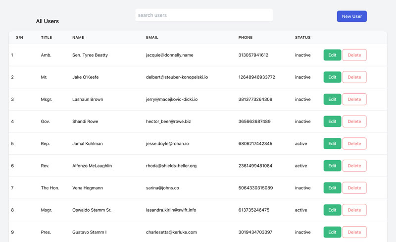

# A Simple Assessment Project 

> In this project I built a simple user page displaying list of users with pagination and ability to filter and sort the returned list of available users.  




## Built With

- Ruby v2.6.5
- Ruby on Rails v6.0.3.2
- RSpec
- Tailwind CSS

## Live Demo

[Live Demo](https://webspoon-assesment.herokuapp.com/)

## Getting Started

To get a local copy up and running follow these simple example steps.

### Prerequisites

Ruby: 2.7.2
Rails: 6.0.3.2
Postgres: >=9.5

### Setup

~~~bash
$ git clone https://github.com/acushlakoncept/assesment-webspoon.git
$ cd assesment-webspoon
~~~

Install gems with:

```
bundle install
```

Setup database with:

> make sure you have postgress sql installed and running on your system

```
   rails db:create
   rails db:migrate
```

### Usage

Start server with:

```
    rails server
```

Open `http://localhost:3000/` in your browser.

### Run tests

```
    rpsec 
```

# Authors

👤 **Uduak Essien**

- Github: [@acushlakoncept](https://github.com/acushlakoncept/)
- Twitter: [@acushlakoncept](https://twitter.com/acushlakoncept)
- Linkedin: [acushlakoncept](https://www.linkedin.com/in/acushlakoncept/)


## 🤝 Contributing

Contributions, issues and feature requests are welcome!

Feel free to check the [issues page](issues/).

## Show your support

Give a ⭐️ if you like this project!

